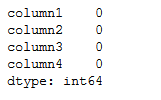
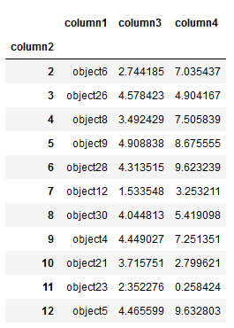

# Creating and Modifying a Dataframe from a CSV file

Grab the file and name columns.

```Python
import numpy as np
import pandas as pd
from pandas import Series, DataFrame

address = 'files/filename.csv'
data = pd.read_csv(address)

data.columns = ['column1', 'column2', 'column3', 'column4']

#Output head of DataFrame
data.head()
```


```Python
#Check for missing values
data.isnull()

#Count missing values
data.isnull().sum()
```


```python
#Use fillna to replace null values if required
data_nonull= data.fillna(0)
data_nonull
```

Group by any column:

```Python
data_group = data.groupby(data['column1'])
#Print out the average, min, max, or median value for each group.
data_group.mean()
```

