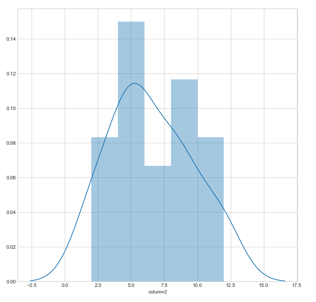

# Plotting from a Dataframe

A few simple datavisuals using Seaborn and Matplotlib.

```python
import numpy as np
import pandas as pd
from pandas import Series, DataFrame

from pandas.tools.plotting import scatter_matrix

import matplotlib.pyplot as plt
from pylab import rcParams
import seaborn as sb

#Set parameters and style
%matplotlib inline
rcParams['figure.figsize'] = 10, 10
sb.set_style('whitegrid')

address = 'C:/filename.csv'
data = pd.read_csv(address)

data.columns = ['column1', 'column2', 'column3', 'column4']
```

```python
#plot as histogram
plot1 = data['column2']
plot1.plot(kind='hist')
```

```python
#histogram with seaborn
sb.distplot(plot1)
```

```python
#scatter plot
data.plot(kind ='scatter', x='column2', y='column3', c=['red'], s=20)
```

```python

#scatter plot matrix
sb.pairplot(data)
```

```python

#boxplot
data.boxplot('column3', by='column2')
```

