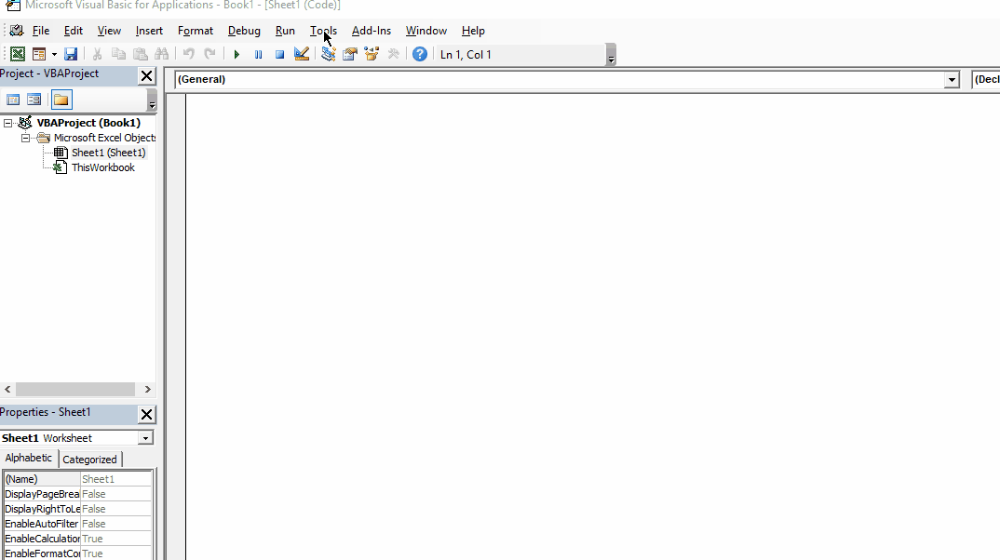

# Connecting to a data source using ActiveX Data Objects (ADO) in Microsoft Office

First add ADO object reference, Microsoft ActiveX Data Objects 2.8 Library from the Tools menu.



For the following you will need:

-Provider (I am using SQLOLEDB)

-Data Source Name

-User ID

-Password

```

Sub GetData()

Dim cnn As New ADODB.Connection
Dim rst As New ADODB.Recordset
Dim ConnStr As String
Dim StrQuery As String
Dim WorkBookName As String


SourceSheet = "Master Worksheet"


    WorkBookName = "Output"


    ConnectionString = "Provider=SQLOLEDB.1;Password=****;Persist Security Info=True;User ID=****;Data Source=****;Use Procedure for Prepare=1;Auto Translate=True;Packet Size=4096;Use Encryption for Data=False;Tag with column collation when possible=False"


    cnn.Open ConnectionString
    cnn.CommandTimeout = 300

     StrQuery = "SELECT TOP 1000 * FROM [database1].[dbo].[table1] "

     MsgBox (StrQuery)


    rst.Open StrQuery, cnn

    On Error Resume Next
       ActiveWorkbook.Worksheets(WorkBookName).Cells.SpecialCells(xlCellTypeConstants, 23).ClearContents

    For intColIndex = 0 To rst.Fields.Count - 1
       ActiveWorkbook.Worksheets(WorkBookName).Range("A1").Offset(0, intColIndex).Value = rst.Fields(intColIndex).Name
    Next

    ActiveWorkbook.Worksheets(WorkBookName).Range("A2").CopyFromRecordset rst

    cnn.Close


End Sub

```
